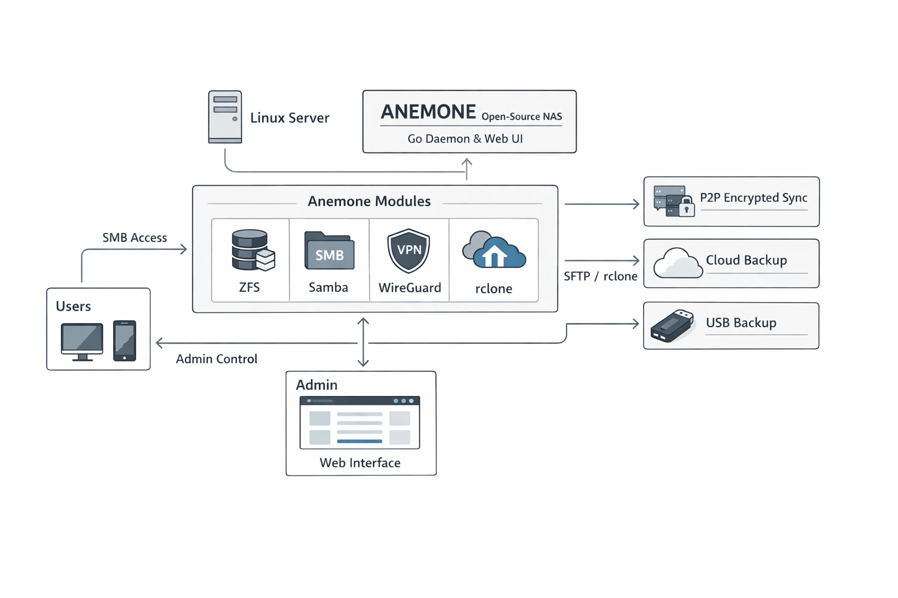

# Anemone

**Multi-user NAS with P2P encrypted backup synchronization**

---

> **v0.20.0-beta** - This project is under active development. Use in production at your own risk.
> See [DISCLAIMER](#disclaimer) for liability limitations.

---

## Architecture



## Features

- **Multi-user** with individual SMB shares
- **Web file browser** - Browse, upload, download, rename, delete files from the browser
- **OnlyOffice integration** - Edit Office documents (DOCX, XLSX, PPTX) directly in the browser, view PDFs and images
- **P2P synchronization** with end-to-end encryption (AES-256-GCM)
- **Cloud backup** via rclone to SFTP, S3 (AWS, Backblaze B2, Wasabi, MinIO), WebDAV (Nextcloud, ownCloud), or any named rclone remote - with optional per-destination encryption
- **USB backup** to external drives with config-only or full data modes
- **WireGuard VPN** client for secure peer connections
- **Storage management** - Create ZFS pools, format, mount, eject disks from web UI
- **Incremental sync** - Only modified files are transferred
- **Quotas** per user (Btrfs recommended)
- **Trash** with configurable retention and restore
- **Logging system** with configurable levels, rotation, and admin log viewer
- **Dark theme web interface** for administration
- **Bilingual** French / English
- **Scheduling** for all backup types (interval, daily, weekly, monthly)

## Quick Install

### Option 1: Latest release (recommended)

```bash
sudo apt update
curl -sL -o anemone.tar.gz $(curl -s https://api.github.com/repos/juste-un-gars/anemone/releases/latest | grep -o '"tarball_url": "[^"]*"' | cut -d'"' -f4)
mkdir -p anemone && tar xzf anemone.tar.gz -C anemone --strip-components=1
cd anemone
sudo ./install.sh
```

### Option 2: Latest development (git)

```bash
sudo apt update
git clone https://github.com/juste-un-gars/anemone.git
cd anemone
sudo ./install.sh
```

Then open `https://localhost:8443` to complete the setup.

**Requirements**: Linux (Debian/Ubuntu or Fedora/RHEL), sudo access, internet connection.

## Documentation

| Guide | Description |
|-------|-------------|
| [Installation](docs/installation.md) | Full installation and options |
| [Storage Setup](docs/storage-setup.md) | RAID, ZFS, Btrfs |
| [User Guide](docs/user-guide.md) | Users, shares, quotas |
| [P2P Sync](docs/p2p-sync.md) | Peers, scheduler, restore |
| [Cloud Backup](docs/rclone-backup.md) | Backup to SFTP, S3, WebDAV via rclone |
| [USB Backup](docs/usb-backup.md) | Backup to USB drives |
| [Security](docs/security.md) | Encryption, keys, architecture |
| [Troubleshooting](docs/troubleshooting.md) | Common issues and solutions |
| [Advanced Configuration](docs/advanced.md) | Environment variables, external drives |
| [Translation](docs/i18n.md) | Add a new language |
| [Uninstall](docs/uninstall.md) | Complete removal |
| [API Reference](docs/API.md) | REST API endpoints |
| [User Manifests](docs/user-manifests.md) | Manifest system for sync |

## Update

### Git install

```bash
cd /path/to/anemone
git pull
go build -o anemone cmd/anemone/main.go
sudo systemctl restart anemone
```

### Release install

Download and extract the latest release, then re-run the installer:

```bash
curl -sL -o anemone.tar.gz $(curl -s https://api.github.com/repos/juste-un-gars/anemone/releases/latest | grep -o '"tarball_url": "[^"]*"' | cut -d'"' -f4)
mkdir -p anemone && tar xzf anemone.tar.gz -C anemone --strip-components=1
cd anemone
sudo ./install.sh
```

## Support

- **Issues**: https://github.com/juste-un-gars/anemone/issues
- **Discussions**: https://github.com/juste-un-gars/anemone/discussions
- **Support the project**: [PayPal](https://paypal.me/justeungars83)

## License

GNU Affero General Public License v3.0 (AGPLv3)

Copyright (C) 2025 juste-un-gars

---

## Disclaimer

This software is provided "AS IS", without warranty of any kind.

The author shall not be held liable for:
- Data loss or corruption
- Direct or indirect damages
- Service interruptions
- Security issues

**Recommendations**:
- Test in development environment before production
- Maintain external backups
- Do not use as sole backup solution

See AGPL v3.0 license (sections 15 and 16) for details.
